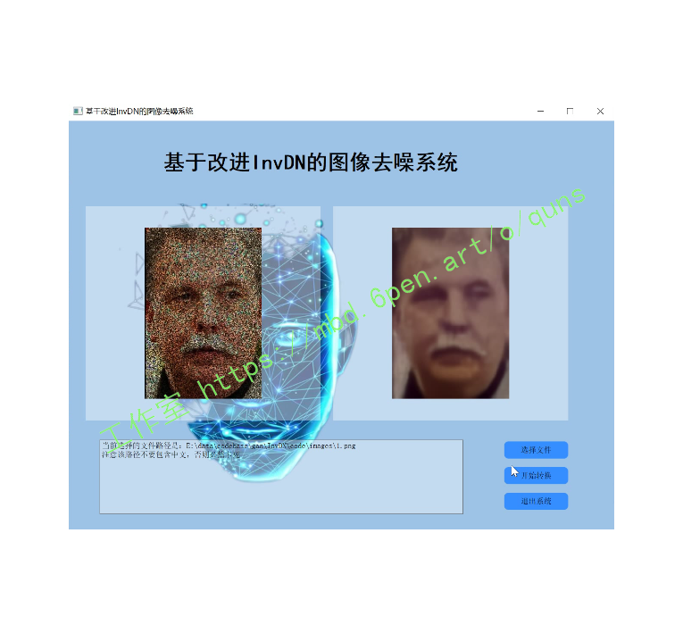
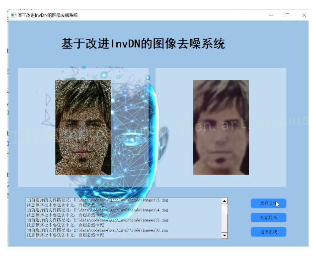
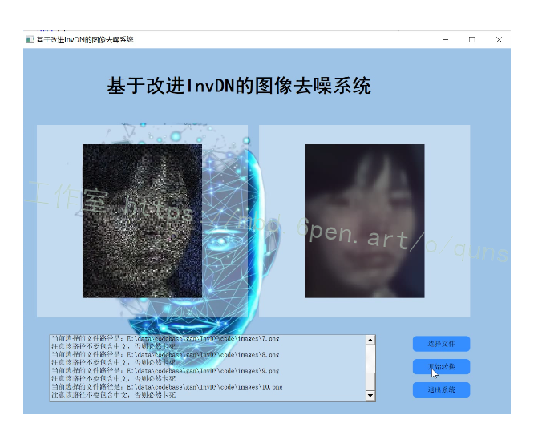
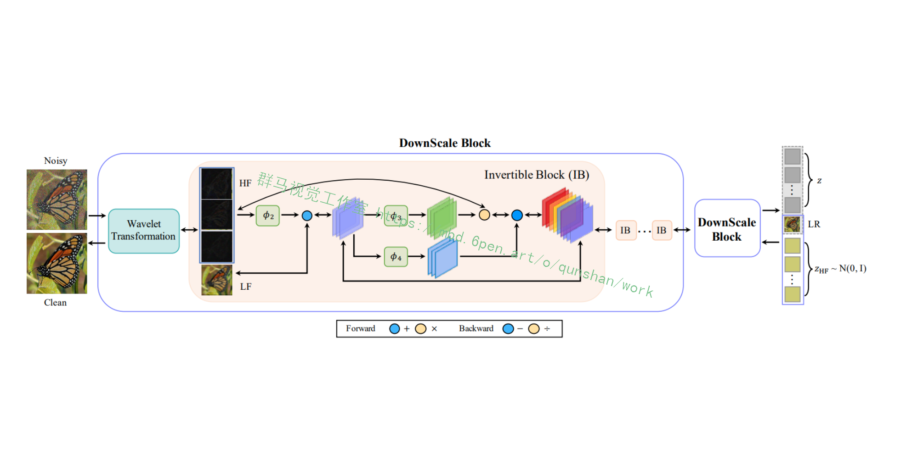
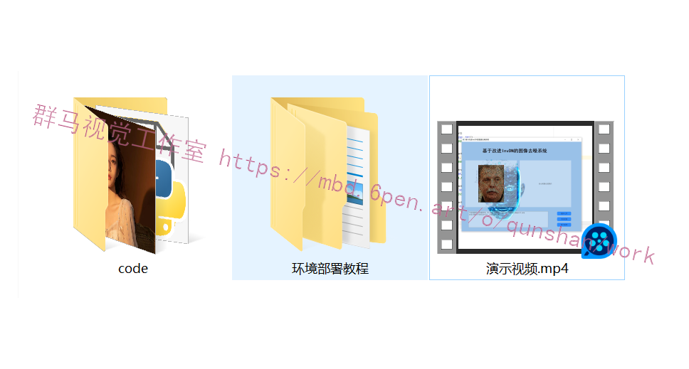

# 1.研究背景
可逆网络在图像去噪方面有各种各样的好处，因为它们是轻量级的，信息无损的，并且在反向传播过程中节省内存。然而，应用可逆模型去噪具有挑战性，因为输入是有噪声的，而反向输出是干净的，遵循两种不同的分布。我们提出了一个可逆去噪网络，InvDN，来解决这一挑战。InvDN将噪声输入转换为低分辨率的干净图像和包含噪声的潜在表示。为了去除噪声并恢复干净的图像，InvDN在还原过程中使用从先前分布中采样的另一个噪声代表来替换噪声代表。InvDN的去噪性能优于所有现有的竞争模型，为SIDD数据集实现了新的最先进的结果，同时享受更少的运行时间。而且，与最近提出的DANet相比，InvDN的大小要小得多，只有4.2%的参数数。此外，通过操纵噪声潜在表示，InvDN还能够产生更类似于原始的噪声。

# 2.图片演示






# 3.视频演示
[基于改进InvDN的图像去噪系统（源码＆教程）_哔哩哔哩_bilibili](https://www.bilibili.com/video/BV1cG411T7hg/?vd_source=bc9aec86d164b67a7004b996143742dc)

# 4.研究现状
[该博客总结和讨论了图像去噪的核心算法](https://afdian.net/item?plan_id=f2e9ac3c73b411ed9b2a52540025c377)。广泛使用的去噪方法可分为传统方法和当前数据驱动的深度学习方法。

传统方法。模型驱动去噪方法通常构造一个带损失和正则项的映射优化问题。大多数传统的建模方法都需要假设噪声分布。一种假定的分布是高斯混合分布，它被用作自然斑块或斑块组上噪声的近似器[58，13，49]。正则项通常基于干净图像的先验。全变差[43]去噪是利用图像的统计特性去噪。稀疏性[37]在字典学习方法[20]中被加强，以从干净的图像中学习过完备的字典。非局部相似[11，21]方法使用共享相似模式的非局部补丁。著名的BM3D [17]和NLM [11]采用了这种策略。然而，由于对空间不变噪声或干净图像的先验假设，这些模型是有限的，这通常不同于真实情况，其中噪声是空间变化的。

数据驱动的深度学习去噪。近年来，深度学习方法取得了快速进展，在很大程度上提高了去噪性能。由于缺乏真实数据，早期的深度模型主要关注合成噪声图像去噪。由于一些大型真实噪声数据集，如DND [40]和SIDD [2]，目前的研究重点是盲真实图像去噪。真实图像去噪主要有两种流。一种是将在合成数据集上运行良好的方法应用于真实数据集，同时考虑这两个领域之间的差距[54，24]。在这个方向上，目前最有竞争力的方法是AINDNet [29]，它通过自适应实例归一化操作，将从合成到真实的传递学习应用到去噪。

另一个方向是用更复杂的分布来模拟真实噪声，并设计新的网络架构[10，14]。由尤等人提出的VDN [50]假设噪声遵循逆伽马分布，并且我们观察到的干净图像是不可用的真实干净图像的共轭高斯先验。他们基于这些假设提出了一个新的训练目标，并使用两个并行分支来学习同一网络中的这两个分布。它的潜在局限性是当噪声分布变得复杂时，这些假设是不合适的。后来，DANet [51]放弃了噪声分布的假设，并采用了GAN框架来训练模型。该架构中还采用了两个并行分支:一个用于去噪，另一个用于噪声生成。这种设计概念是三种图像对(干净和有噪声、干净和产生噪声以及去噪和有噪声)遵循相同的分布，因此它们使用鉴别器来训练模型。潜在的限制是基于遗传神经网络的模型训练不稳定，因此需要更长时间才能收敛[8]。此外，VDN和达内都在并行分支中使用了Unet [42]，使得它们的模型非常大。

为了压缩模型大小，我们探索可逆网络。据我们所知，很少有研究将可逆网络应用于去噪文献。噪声流[1]引入了一种可逆的体系结构来学习真实的噪声分布，以生成真实的噪声作为数据扩充的一种方式。使用噪声流生成噪声图像需要除sRGB图像之外的额外信息，包括原始RGB图像、ISO和相机特定值。他们没有提出新的去噪主干。到目前为止，还没有关于真实图像去噪的可逆网络的报道。


# 5.改进的创新点
（1）传统可逆网络的潜在变量遵循单一分布。相反，改进的InvDN有两个遵循两种不同分布的潜在变量。因此，改进的InvDN不仅可以恢复干净的图像，还可以生成新的噪声图像。
（2）我们在SIDD测试集上实现了一个新的最先进的(SOTA)结果，使用了比以前的SOTA方法少得多的参数和运行时间。
（3）[参考该博客，改进的InvDN能够生成与原始噪声图像更相似的新噪声图像](https://mbd.pub/o/bread/Y52TlZ9u)。

# 6.代码实现
```
import torch
import logging
import models.modules.discriminator_vgg_arch as SRGAN_arch
from models.modules.Inv_arch import *
from models.modules.Subnet_constructor import subnet
import math
logger = logging.getLogger('base')


####################
# define network
####################
def define_G(opt):
    opt_net = opt['network_G']
    which_model = opt_net['which_model_G']
    subnet_type = which_model['subnet_type']
    if opt_net['init']:
        init = opt_net['init']
    else:
        init = 'xavier'

    down_num = int(math.log(opt_net['scale'], 2))

    netG = InvNet(opt_net['in_nc'], opt_net['out_nc'], subnet(subnet_type, init), opt_net['block_num'], down_num)

    return netG

def define_subG(opt):
    opt_net = opt['network_subG']
    which_model = opt_net['which_model_G']
    subnet_type = which_model['subnet_type']
    if opt_net['init']:
        init = opt_net['init']
    else:
        init = 'xavier'

    down_num = int(math.log(opt_net['scale'], 2))

    netG = InvNet(opt_net['in_nc'], opt_net['out_nc'], subnet(subnet_type, init), opt_net['block_num'], down_num)

    return netG

#### Discriminator
def define_D(opt):
    opt_net = opt['network_D']
    which_model = opt_net['which_model_D']

    if which_model == 'discriminator_vgg_128':
        netD = SRGAN_arch.Discriminator_VGG_128(in_nc=opt_net['in_nc'], nf=opt_net['nf'])
    else:
        raise NotImplementedError('Discriminator model [{:s}] not recognized'.format(which_model))
    return netD


#### Define Network used for Perceptual Loss
def define_F(opt, use_bn=False):
    gpu_ids = opt['gpu_ids']
    device = torch.device('cuda' if gpu_ids else 'cpu')
    # PyTorch pretrained VGG19-54, before ReLU.
    if use_bn:
        feature_layer = 49
    else:
        feature_layer = 34
    netF = SRGAN_arch.VGGFeatureExtractor(feature_layer=feature_layer, use_bn=use_bn,
                                          use_input_norm=True, device=device)
    netF.eval()  # No need to train
    return netF
```

# 7.系统整合
下图[完整源码＆环境部署视频教程＆自定义UI界面](https://s.xiaocichang.com/s/8af11d)

参考博客[《基于改进InvDN的图像去噪系统（源码＆教程）》](https://mbd.pub/o/qunma/work)

# 8.参考文献
***
[1]A.Abdelhamed, M. Brubaker, and M. Brown. Noise flow:
Noise modeling with conditional normalizing flows. In 2019IEEE/CVF International Conference on Computer Vision(ICCV), pages 3165-3173,2019.
[2]Abdelrahman Abdelhamed,Stephen Lin,and Michael s.
Brown. A high-quality denoising dataset for smartphonecameras. In IEEE Conference on Computer Vision and Pat-tern Recognition (CVPR), June 2018.
[3]ABSoft. Neat image.
[4]M. Aharon，M. Elad,and A. Bruckstein. K-svd: An al-
gorithm for designing overcomplete dictionaries for sparserepresentation.IEEE Transactions on Signal Processing,54(11):4311-4322, Nov 2006.
[5]Saeed Anwar and Nick Barnes. Real image denoising with
feature attention. In Proceedings of the IEEE InternationalConference on Computer Vision, pages 3155-3164,2019.
[6]Saeed Anwar, Cong Phuoc Huynh,and Fatih Porikli. lden-
tity enhanced residual image denoising. In Proceedings ofthe IEEE/CVF Conference on Computer Vision and PatternRecognition Workshops, pages 520-521,2020.
[7]Lynton Ardizzone，Carsten Lith，Jakob Kruse,Carsten
Rother，and Ullrich Kothe. Guided image generation withconditional invertible neural networks. 2019.
[8] Martin Arjovsky，Soumith Chintala,and Léon Bottou.
Wasserstein generative adversarial networks. In Proceedingsof the 34th International Conference on Machine Learning-Volume 70, pages 214-223,2017.
[9]Jens Behrmann，Will Grathwohl，Ricky T. Q.Chen,David
Duvenaud,and Joern-Henrik Jacobsen. Invertible residualnetworks. In Kamalika Chaudhuri and Ruslan Salakhutdi-nov,editors，Proceedings of the 36th International Confer-ence on Machine Learning，volume 97 of Proceedings ofMachine Learning Research, pages 573-582.PMLR,09-15Jun 2019.


---
#### 如果您需要更详细的【源码和环境部署教程】，除了通过【系统整合】小节的链接获取之外，还可以通过邮箱以下途径获取:
#### 1.请先在GitHub上为该项目点赞（Star），编辑一封邮件，附上点赞的截图、项目的中文描述概述（About）以及您的用途需求，发送到我们的邮箱
#### sharecode@yeah.net
#### 2.我们收到邮件后会定期根据邮件的接收顺序将【完整源码和环境部署教程】发送到您的邮箱。
#### 【免责声明】本文来源于用户投稿，如果侵犯任何第三方的合法权益，可通过邮箱联系删除。